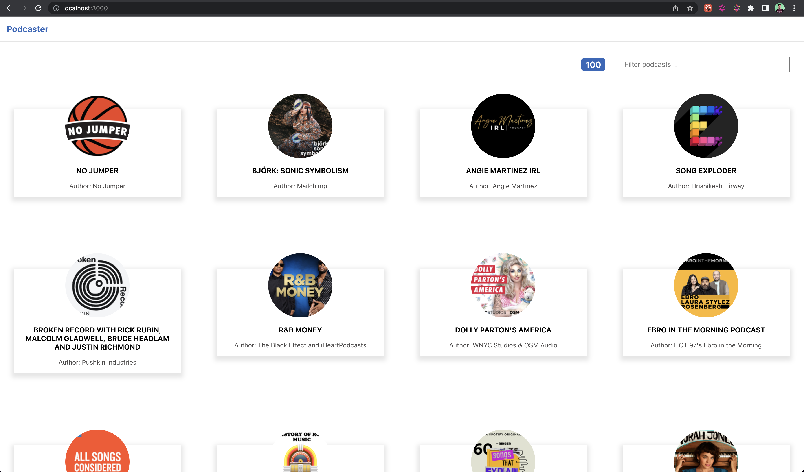
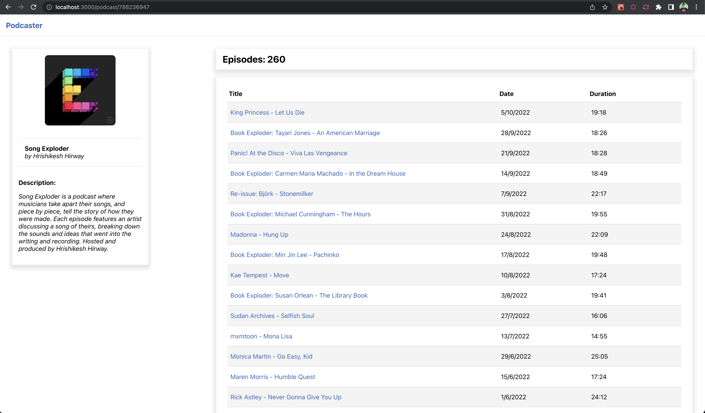
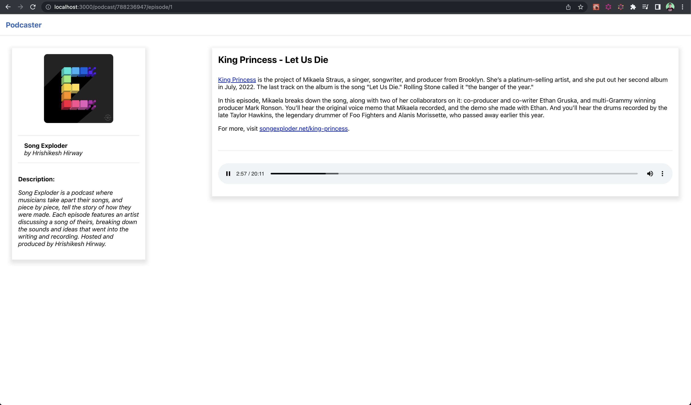

# ¿Qué es?

Esto es una aplicación para buscar y escuchar podcasts! 

En la pantalla principal se pueden ver los mejores 100 podcasts según iTunes. Se pueden filtrar los mismos de acuerdo a su nombre o a su autor.

Al seleccionar un podcast se podrá ver el detalle del mismo, incluyendo su lista de episodios.

Al seleccionar un episodio se podrá ver más información de este como así también poder escucharlo.

# ¿Cómo ejecutar la aplicación?

## Modo desarrollo

### `npm start`

Abrir [http://localhost:3000](http://localhost:3000) para ver la aplicación en el navegador.

## Modo producción

### `npm run build`

Crea un build apto para producción en la carpeta `build`.

------------------

Para más información este proyecto fue creado usando [Create React App](https://github.com/facebook/create-react-app).